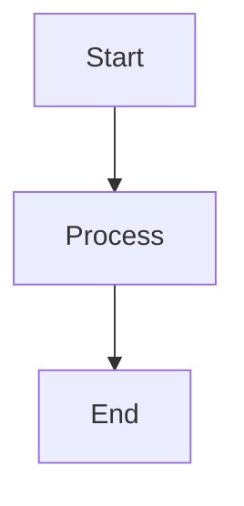

# Concordia Documentation Website

This directory contains the source files for the Concordia documentation website, built with [MkDocs](https://www.mkdocs.org/) and the [Material theme](https://squidfunk.github.io/mkdocs-material/).

## 📁 Structure

```
docs/
├── mkdocs.yml           # Configuration file
├── docs/                # Documentation source files
│   ├── index.md         # Homepage
│   ├── getting-started/ # Installation and quick start guides
│   ├── core-concepts/   # Framework architecture and concepts
│   ├── tutorials/       # Step-by-step tutorials
│   │   ├── basic/       # Beginner tutorials
│   │   └── advanced/    # Advanced tutorials
│   ├── examples/        # Example implementations and notebooks
│   ├── api/             # API reference documentation
│   └── community/       # Contributing and support guides
└── README.md            # This file
```

## 🚀 Quick Start

### Prerequisites

- Python 3.8+
- pip

### Installation

1. **Install MkDocs and dependencies:**
   ```bash
   pip install mkdocs mkdocs-material
   ```

2. **Navigate to the docs directory:**
   ```bash
   cd docs
   ```

3. **Start the development server:**
   ```bash
   mkdocs serve
   ```

4. **Open your browser to:**
   ```
   http://localhost:8000
   ```

The documentation will automatically reload when you make changes to the source files.

## 🛠️ Development

### Adding New Pages

1. **Create a new Markdown file** in the appropriate directory under `docs/`
2. **Add the page to the navigation** in `mkdocs.yml`:
   ```yaml
   nav:
     - Section Name:
       - Page Title: path/to/page.md
   ```
3. **Link to the page** from other relevant pages

### Content Guidelines

- **Use clear, concise language**
- **Include code examples** where helpful
- **Add diagrams** for complex concepts using Mermaid
- **Test all code examples** to ensure they work
- **Follow the existing style** and formatting

### Markdown Extensions

The site supports several useful Markdown extensions:

#### Code Highlighting
```python
def example_function():
    """This code will be syntax highlighted."""
    return "Hello, Concordia!"
```

#### Admonitions
```markdown
!!! note "Important Information"
    This creates a highlighted note box.

!!! warning "Be Careful"
    This creates a warning box.

!!! tip "Pro Tip"
    This creates a tip box.
```

#### Tabbed Content
```markdown
=== "Tab 1"
    Content for tab 1

=== "Tab 2"
    Content for tab 2
```

#### Mermaid Diagrams
```markdown

```

## 🏗️ Building

### Local Build

To build the static site locally:

```bash
mkdocs build
```

This creates a `site/` directory with the generated HTML files.

### Testing the Build

To test the built site:

```bash
mkdocs serve --dev-addr=localhost:8000
```

### Clean Build

To start fresh:

```bash
# Remove the built site
rm -rf site/

# Rebuild
mkdocs build
```

## 🚀 Deployment

### GitHub Pages

The easiest way to deploy is using GitHub Pages:

1. **Push changes to the main branch**
2. **Deploy to GitHub Pages:**
   ```bash
   mkdocs gh-deploy
   ```

This automatically builds the site and pushes it to the `gh-pages` branch.

### Other Hosting Options

The built site is static HTML and can be hosted anywhere:

- **Netlify**: Connect your GitHub repo for automatic deployment
- **Vercel**: Similar to Netlify with great performance
- **AWS S3**: For scalable static hosting
- **Azure Static Web Apps**: Microsoft's static hosting solution

## ⚙️ Configuration

### Site Settings

Key configuration options in `mkdocs.yml`:

```yaml
site_name: Concordia Documentation        # Site title
site_description: "Your description"      # Meta description
site_author: "Your name"                  # Author information
site_url: "https://your-domain.com"       # Production URL
```

### Theme Customization

The Material theme can be customized:

```yaml
theme:
  name: material
  palette:
    - scheme: default      # Light mode
      primary: deep purple # Primary color
      accent: purple       # Accent color
  features:
    - navigation.tabs      # Top-level tabs
    - navigation.sections  # Collapsible sections
    - search.highlight     # Highlight search results
```

### Adding Plugins

To add new functionality:

```yaml
plugins:
  - search              # Built-in search
  - git-revision-date   # Show last modified dates
  - minify:             # Minify HTML/CSS/JS
      minify_html: true
```

## 🔧 Troubleshooting

### Common Issues

**MkDocs command not found**
```bash
pip install mkdocs mkdocs-material
```

**Theme not loading**
```bash
pip install --upgrade mkdocs-material
```

**Navigation not updating**
- Check the `nav:` section in `mkdocs.yml`
- Ensure file paths are correct
- Restart the development server

**Images not displaying**
- Place images in the `docs/` directory
- Use relative paths: ``
- Check file names and extensions

### Performance Issues

**Slow build times**
- Remove unnecessary plugins
- Optimize image sizes
- Use fewer markdown extensions

**Large site size**
- Compress images
- Remove unused files
- Enable minification

## 📝 Contributing

### Documentation Style Guide

1. **Headers**: Use descriptive, hierarchical headers
2. **Code blocks**: Always specify the language for syntax highlighting
3. **Links**: Use descriptive link text, not "click here"
4. **Images**: Include alt text for accessibility
5. **Lists**: Use numbered lists for steps, bullet lists for items

### Review Process

1. **Test locally** before submitting changes
2. **Check all links** work correctly
3. **Verify code examples** run successfully
4. **Follow the existing style** and structure

### Content Standards

- **Accuracy**: All information should be current and correct
- **Completeness**: Cover the topic thoroughly
- **Clarity**: Use simple language and clear examples
- **Consistency**: Follow established patterns and conventions

## 📊 Analytics and SEO

### Search Engine Optimization

The site includes built-in SEO features:

- **Meta descriptions** for each page
- **Structured navigation** for search engines
- **Semantic HTML** structure
- **Fast loading times**

### Analytics Integration

To add analytics, modify `mkdocs.yml`:

```yaml
extra:
  analytics:
    provider: google
    property: G-XXXXXXXXXX  # Your Google Analytics ID
```

## 🆘 Support

Need help with the documentation?

1. **Check this README** for common solutions
2. **Review the [MkDocs documentation](https://www.mkdocs.org/)**
3. **Consult the [Material theme docs](https://squidfunk.github.io/mkdocs-material/)**
4. **Ask for help** in the project's GitHub discussions

---

**Happy documenting!** 📚✨
