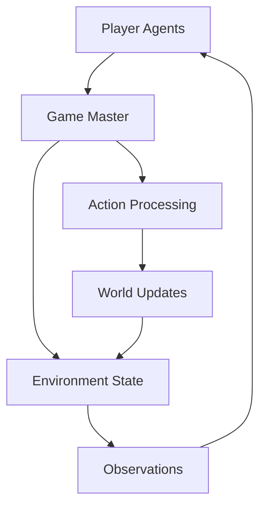

# Understanding the Concordia Framework

Concordia is built around a unique architecture inspired by tabletop role-playing games. This guide explains the core concepts and how they work together to create powerful agent-based simulations.

## The Game Master Pattern

At the heart of Concordia is the **Game Master (GM)** pattern, borrowed from tabletop RPGs like Dungeons & Dragons.

### How It Works



1. **Player agents** describe their intended actions in natural language
2. The **Game Master** interprets these actions and determines outcomes
3. The **environment state** is updated based on the GM's decisions
4. **Observations** are generated and sent back to the agents
5. The cycle repeats, creating an ongoing simulation

### Why This Pattern?

- **Natural Language Interface**: Agents can express complex intentions simply
- **Flexible Interpretation**: The GM can handle unexpected or creative actions
- **Realistic Outcomes**: Complex social and physical dynamics are possible
- **Emergent Behavior**: Unexpected interactions arise from simple rules

## Core Architecture Components

### 1. Agents (EntityAgent)

Agents are the primary actors in your simulation. Each agent is composed of multiple **components** that define its behavior.

```python
from concordia.agents import entity_agent

# An agent is a container for components
agent = entity_agent.EntityAgent(
    agent_name="Alice",
    act_component=acting_component,
    context_components=[
        instructions_component,
        memory_component,
        observation_component,
        # ... other components
    ]
)
```

### 2. Components

Components are modular pieces that handle specific aspects of an agent's cognition:

#### Context Components
- **InstructionsComponent**: Defines the agent's identity and role
- **MemoryComponent**: Stores and retrieves past experiences
- **ObservationComponent**: Processes what the agent perceives
- **PlanComponent**: Manages multi-step planning

#### Acting Components
- **ActingComponent**: Decides what action to take based on context

```python
from concordia.components.agent import v2 as agent_components

# Create components
instructions = agent_components.instructions.Instructions(
    agent_name="Alice",
    instruction="You are a helpful and curious researcher."
)

memory = agent_components.memory.Memory(
    agent_name="Alice"
)
```

### 3. Prefabs

Prefabs are pre-configured agent templates that combine components in useful ways:

```python
from concordia.prefabs import basic_agent

# Use a prefab to quickly create an agent
agent = basic_agent.BasicAgent(
    name="Alice",
    goal="Study social interactions in the town square"
)
```

## The Act-Observe Cycle

Concordia simulations follow a structured cycle:

### Act Phase

1. **Context Gathering**: The agent's `ActingComponent` queries all context components
2. **Prompt Construction**: A large prompt is built containing:
   - Agent identity and goals
   - Recent memories
   - Current observations
   - Relevant plans
3. **LLM Query**: The prompt is sent to a language model
4. **Action Generation**: The LLM returns a natural language action

### Observe Phase

1. **GM Processing**: The Game Master receives all agent actions
2. **Outcome Determination**: The GM (often using an LLM) determines what happens
3. **Observation Generation**: Personalized observations are created for each agent
4. **Memory Update**: Agents process and store their observations

```python
# Example of the cycle in code
for turn in range(num_turns):
    # Act phase
    actions = {}
    for agent in agents:
        action = agent.act()  # Generates natural language action
        actions[agent.name] = action

    # Observe phase
    observations = game_master.step(actions)  # GM processes actions
    for agent in agents:
        agent.observe(observations[agent.name])  # Agents update memories
```

## Memory and State Management

### Associative Memory

Concordia uses associative memory to help agents remember relevant information:

- **Semantic Search**: Find memories related to current context
- **Recency Bias**: Recent events are more easily recalled
- **Importance Weighting**: Significant events are prioritized

### Component State

Each component maintains its own state:

- **Instructions**: Static identity information
- **Memory**: Dynamic collection of experiences
- **Plans**: Current goals and strategies
- **Observations**: Recent perceptions

## Flexibility and Extensibility

### Custom Components

You can create custom components for specific behaviors:

```python
from concordia.typing import entity_component

class CustomNegotiationComponent(entity_component.ContextComponent):
    def __init__(self, agent_name: str):
        self._agent_name = agent_name

    def pre_observe(self, observation: str) -> str:
        # Process observations for negotiation context
        return f"Negotiation context for {self._agent_name}: {observation}"
```

### Multiple Game Masters

Different GMs can handle different aspects:

- **Social GM**: Manages interpersonal interactions
- **Physical GM**: Handles movement and physical actions
- **Economic GM**: Manages resource transactions

### Integration with External Systems

Concordia can integrate with:

- **APIs**: For real-world data or services
- **Databases**: For persistent state management
- **Other AI Systems**: For specialized processing

## Best Practices

### Component Design

1. **Single Responsibility**: Each component should handle one aspect of cognition
2. **Loose Coupling**: Components should be independently testable
3. **Clear Interfaces**: Use well-defined input/output contracts

### Memory Management

1. **Selective Storage**: Don't store every detail, focus on important events
2. **Regular Cleanup**: Prune old or irrelevant memories
3. **Structured Queries**: Use specific prompts for memory retrieval

### Performance Optimization

1. **Batch LLM Calls**: Process multiple agents simultaneously when possible
2. **Cache Results**: Store frequently accessed information
3. **Limit Context Length**: Keep prompts within LLM token limits

## Next Steps

Now that you understand the framework:

1. 🏗️ Try [Building Your First Agent](agents-and-components.md)
2. 🎲 Learn about [The Game Master Pattern](game-master.md)
3. 🚀 Create [Your First Simulation](../tutorials/basic/creating-simulation.md)

---

*Ready to dive deeper? Explore the detailed guides on [Agents and Components](agents-and-components.md) next.*
