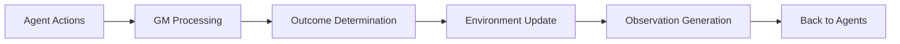

# The Game Master Pattern

The Game Master (GM) is one of Concordia's most innovative features, inspired by tabletop role-playing games. This page explains how the GM works and how to use it effectively.

## What is the Game Master?

The Game Master acts as the narrator and referee of your simulation. Just like in Dungeons & Dragons, the GM:

- **Interprets** agent actions in natural language
- **Determines outcomes** based on simulation rules
- **Manages** the environment state
- **Generates** observations for agents
- **Handles** interactions between agents and the world

## How the GM Works

### The GM Cycle



1. **Collect Actions**: GM receives natural language actions from all agents
2. **Process Actions**: GM interprets what each agent wants to do
3. **Determine Outcomes**: GM decides what actually happens
4. **Update Environment**: GM modifies the world state
5. **Generate Observations**: GM creates personalized feedback for each agent

### Example GM Interaction

**Agent Action**: "I try to convince the shopkeeper to give me a discount by mentioning I'm a regular customer."

**GM Processing**:
- Evaluates the agent's persuasion attempt
- Considers the shopkeeper's personality
- Checks if the agent is actually a regular customer
- Determines the outcome based on these factors

**GM Response**: "The shopkeeper recognizes you and smiles warmly. 'For you, my friend, I can offer 10% off today,' he says with a wink."

## Types of Game Masters

### Basic Game Master

The simplest GM handles straightforward scenarios:

```python
from concordia.components.game_master import basic_game_master

gm = basic_game_master.BasicGameMaster(
    model=language_model,
    memory=shared_memory,
    clock=game_clock,
    name="BasicGM"
)
```

### Specialized Game Masters

You can create GMs for specific domains:

#### Social Game Master
```python
class SocialGameMaster(basic_game_master.BasicGameMaster):
    """Specializes in interpersonal interactions."""

    def __init__(self, **kwargs):
        super().__init__(**kwargs)
        self._social_rules = {
            "politeness_matters": True,
            "reputation_tracking": True,
            "emotional_responses": True
        }

    def _process_social_action(self, action, context):
        # Custom logic for social interactions
        pass
```

#### Economic Game Master
```python
class EconomicGameMaster(basic_game_master.BasicGameMaster):
    """Handles economic transactions and market dynamics."""

    def __init__(self, **kwargs):
        super().__init__(**kwargs)
        self._market_state = {}
        self._prices = {}

    def _process_economic_action(self, action, context):
        # Custom logic for economic interactions
        pass
```

## GM Decision Making

### Prompt Construction

The GM uses carefully crafted prompts to make decisions:

```python
gm_prompt = f"""
You are the Game Master of a social simulation.

Current situation: {current_situation}
Agent actions: {agent_actions}

Your role is to:
1. Determine realistic outcomes for each action
2. Update the environment state
3. Generate appropriate observations

Consider:
- Physical constraints and possibilities
- Social dynamics and relationships
- Emotional responses and motivations
- Consequences of previous actions

Respond with:
1. What happens as a result of the actions
2. How the environment changes
3. What each agent observes
"""
```

### Outcome Determination

The GM considers multiple factors:

- **Action Feasibility**: Is the action physically/socially possible?
- **Agent Capabilities**: Does the agent have the skills/resources?
- **Environmental Constraints**: What does the world allow?
- **Social Dynamics**: How do other agents react?
- **Consequences**: What are the short and long-term effects?

## Multi-GM Architectures

For complex simulations, you can use multiple GMs:

### Hierarchical GMs

```python
class HierarchicalGMSystem:
    def __init__(self):
        self.master_gm = MasterGameMaster()
        self.social_gm = SocialGameMaster()
        self.physical_gm = PhysicalGameMaster()
        self.economic_gm = EconomicGameMaster()

    def process_actions(self, actions):
        # Route actions to appropriate specialized GMs
        social_actions = self._filter_social_actions(actions)
        physical_actions = self._filter_physical_actions(actions)
        economic_actions = self._filter_economic_actions(actions)

        # Process in parallel or sequence
        results = {}
        results.update(self.social_gm.process(social_actions))
        results.update(self.physical_gm.process(physical_actions))
        results.update(self.economic_gm.process(economic_actions))

        # Master GM resolves conflicts and integrates
        return self.master_gm.integrate_results(results)
```

### Collaborative GMs

```python
class CollaborativeGMSystem:
    def __init__(self, gms):
        self.gms = gms
        self.consensus_mechanism = ConsensusResolver()

    def process_actions(self, actions):
        # All GMs evaluate the same actions
        evaluations = []
        for gm in self.gms:
            evaluations.append(gm.evaluate(actions))

        # Resolve disagreements
        return self.consensus_mechanism.resolve(evaluations)
```

## Advanced GM Features

### Memory and Context

GMs maintain memory of past events:

```python
class MemoryEnhancedGM(basic_game_master.BasicGameMaster):
    def __init__(self, **kwargs):
        super().__init__(**kwargs)
        self._event_history = []
        self._relationship_tracker = {}

    def process_actions(self, actions):
        # Consider historical context
        relevant_history = self._get_relevant_history(actions)

        # Make decisions with full context
        outcomes = self._determine_outcomes_with_history(
            actions, relevant_history
        )

        # Update memory
        self._update_memory(actions, outcomes)

        return outcomes
```

### Dynamic Rule Systems

GMs can have evolving rules:

```python
class AdaptiveGM(basic_game_master.BasicGameMaster):
    def __init__(self, **kwargs):
        super().__init__(**kwargs)
        self._rules = {}
        self._rule_weights = {}

    def adapt_rules(self, feedback):
        """Modify rules based on simulation feedback."""
        for rule, weight in self._rule_weights.items():
            if feedback.suggests_rule_too_strict(rule):
                self._rule_weights[rule] *= 0.9
            elif feedback.suggests_rule_too_lenient(rule):
                self._rule_weights[rule] *= 1.1
```

## Best Practices

### GM Design Principles

1. **Consistency**: Similar actions should have similar outcomes
2. **Fairness**: Don't favor any particular agent
3. **Realism**: Outcomes should be believable in context
4. **Engagement**: Create interesting and dynamic scenarios
5. **Clarity**: Make consequences clear to agents

### Prompt Engineering for GMs

- **Be specific** about the GM's role and responsibilities
- **Provide examples** of good decision-making
- **Include constraints** and rules clearly
- **Request structured output** for easier parsing
- **Handle edge cases** explicitly

### Testing GM Behavior

```python
def test_gm_consistency():
    """Test that similar actions produce similar outcomes."""
    gm = create_test_gm()

    action1 = "I politely ask for directions."
    action2 = "I courteously request directions."

    outcome1 = gm.process([action1])
    outcome2 = gm.process([action2])

    assert outcomes_are_similar(outcome1, outcome2)

def test_gm_fairness():
    """Test that the GM doesn't favor specific agents."""
    gm = create_test_gm()

    actions = {
        "Agent1": "I try to buy the last item.",
        "Agent2": "I try to buy the last item."
    }

    outcomes = gm.process(actions)
    assert not unfairly_favors_agent(outcomes, "Agent1")
```

## Integration with External Systems

### API Integration

```python
class APIIntegratedGM(basic_game_master.BasicGameMaster):
    def __init__(self, api_client, **kwargs):
        super().__init__(**kwargs)
        self._api_client = api_client

    def process_actions(self, actions):
        # Some actions might trigger real API calls
        for action in actions:
            if self._requires_external_data(action):
                external_data = self._api_client.fetch_data(action)
                action.context.update(external_data)

        return super().process_actions(actions)
```

### Database Integration

```python
class PersistentGM(basic_game_master.BasicGameMaster):
    def __init__(self, database, **kwargs):
        super().__init__(**kwargs)
        self._db = database

    def process_actions(self, actions):
        # Load relevant world state from database
        world_state = self._db.load_world_state()

        # Process actions
        outcomes = super().process_actions(actions)

        # Save updated state
        self._db.save_world_state(world_state)

        return outcomes
```

## Next Steps

- Understand [Agents and Components](agents-and-components.md)
- Try [Creating Your First Simulation](../tutorials/basic/creating-simulation.md)
- Explore [Advanced Digital Twin Development](../tutorials/advanced/digital-twins.md)

---

*Ready to implement your own Game Master? Check out the [simulation creation tutorial](../tutorials/basic/creating-simulation.md) to see the GM in action!*
