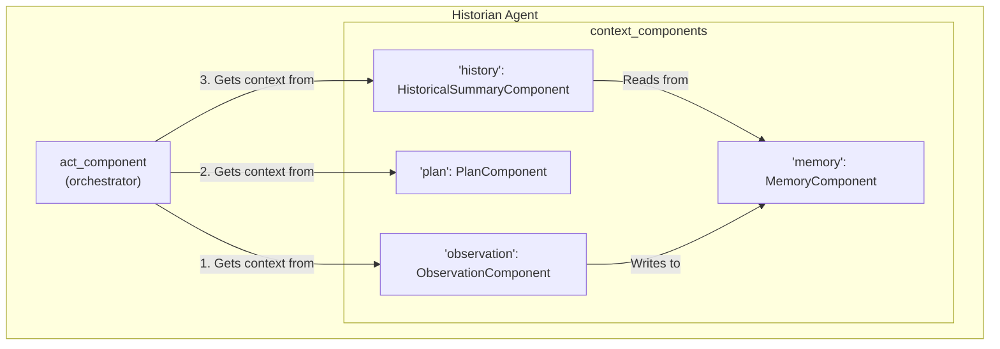

# Tutorial: How to Assemble a Complete Concordia Agent

This tutorial provides a step-by-step guide on how a "prefab" assembles a complete agent in Concordia. Understanding this process is key to creating your own custom agent architectures.

### The Goal of the Prefab

The primary purpose of a **prefab** class is to act as a factory for agents. Its most important method is `.build()`. This method gathers all the necessary "parts" (components), "wires them up" correctly, and outputs a fully functional agent.

We will use the example of a custom **"Historian Agent"** to illustrate the assembly process. This agent has a special `HistoricalSummaryComponent` that allows it to reflect on past events.

---

### The Assembly Line: The `.build()` Method

Let's look at the `build` method from a prefab. This is the heart of the assembly process. We will go through it step-by-step.

```python
# This code would be inside your prefab class, e.g., concordia_custom_components/prefabs/entity/historian.py

def build(
    self,
    model: language_model.LanguageModel,
    memory_bank: basic_associative_memory.AssociativeMemoryBank,
) -> entity_agent_with_logging.EntityAgentWithLogging:
    """This method is the factory that builds the agent."""
    agent_name = self.params['name']
    num_memories = int(self.params['summarize_last_n_memories'])

    # Step 1: Instantiate all necessary components.
    memory = agent_components.memory.AssociativeMemory(memory_bank=memory_bank)
    observation = agent_components.observation.ObservationComponent(model=model, memory=memory)
    plan = agent_components.plan.PlanComponent(model=model, memory=memory)
    history = historical_summary.HistoricalSummaryComponent(
        model=model,
        memory_component_name='memory',
        num_memories_to_summarize=num_memories,
    )

    # Step 2: Assemble components into a named dictionary.
    components = {
        'memory': memory,
        'observation': observation,
        'plan': plan,
        'history': history,
    }

    # Step 3: Define the agent's "thought process" order.
    component_order = [
        'observation',
        'plan',
        'history',
    ]

    # Step 4: Create the main "act" component to orchestrate the others.
    act_component = agent_components.concat_act_component.ConcatActComponent(
        model=model,
        component_order=component_order,
    )

    # Step 5: Build and return the final agent object.
    agent = entity_agent_with_logging.EntityAgentWithLogging(
        agent_name=agent_name,
        act_component=act_component,
        context_components=components,
    )
    return agent
```

---

### The Assembly Process Explained

#### Step 1: Instantiate All Necessary Components

This is like gathering all the individual parts you need to build your machine. Each component is a Python object that encapsulates a specific behavior.

*   `memory = agent_components.memory.AssociativeMemory(...)`
    *   **Purpose:** This is the agent's long-term memory. It's responsible for storing and retrieving observations and experiences. We use the standard `AssociativeMemory` component provided by Concordia.
*   `observation = agent_components.observation.ObservationComponent(...)`
    *   **Purpose:** This is the agent's "eyes and ears." It processes new information from the simulation (e.g., "You see another agent enter the room.") and decides what is important enough to be saved to memory.
*   `plan = agent_components.plan.PlanComponent(...)`
    *   **Purpose:** This is the agent's short-term to-do list. It helps the agent follow multi-step goals (e.g., "1. Go to the store. 2. Buy milk.").
*   `history = historical_summary.HistoricalSummaryComponent(...)`
    *   **Purpose:** This is our custom component! Its job is to look at recent memories and generate a high-level summary. This provides historical context to the agent's decision-making.

#### Step 2: Assemble Components into a Named Dictionary

*   `components = { 'memory': memory, 'observation': observation, ... }`
*   **Why is this important?** This dictionary acts as the agent's internal "wiring diagram." By giving each component instance a unique string name (e.g., `'memory'`), you allow components to find and communicate with each other.
*   For instance, our `HistoricalSummaryComponent` needs to read from memory. We configured it with `memory_component_name='memory'`. When the `history` component runs, it will ask its parent agent for the component named `'memory'`, and the agent will give it a reference to the `AssociativeMemory` instance.

#### Step 3: Define the Agent's "Thought Process" Order

*   `component_order = [ 'observation', 'plan', 'history' ]`
*   **This is the most critical step in defining an agent's personality and reasoning style.** The `component_order` list dictates the exact structure of the final prompt that is sent to the LLM when the agent needs to act.

When `agent.act()` is eventually called, the `act_component` will use this list to build a prompt sequentially:
1.  It gets the output from the `'observation'` component (e.g., "You see a strange green sky.").
2.  Then, it gets the output from the `'plan'` component (e.g., "Your plan is to find the town elder.").
3.  Finally, it gets the output from our custom `'history'` component (e.g., "Historical summary: A strange weather event is unfolding...").

This results in a final prompt to the LLM that looks like this:

> **Final Prompt to LLM:**
>
> ---
> **Observation:** You see a strange green sky.
>
> **Plan:** Your plan is to find the town elder.
>
> **Historical Summary:** A strange weather event is unfolding, causing citizen anxiety.
>
> ---
> **Given this information, what do you do next?**

If you were to change the `component_order`, you would change how the agent "thinks." For example, putting `history` first would prime the agent with historical context *before* it considers its current observations.

#### Step 4: Create the Main "Act" Component

*   `act_component = agent_components.concat_act_component.ConcatActComponent(...)`
*   **Purpose:** The `ConcatActComponent` is a special orchestrator component. Its job is to take the `component_order` list, get the text output from each of those components, and concatenate them together to form the final prompt. It's the "prompt builder" for the agent.

#### Step 5: Build and Return the Final Agent Object

*   `agent = entity_agent_with_logging.EntityAgentWithLogging(...)`
*   **Purpose:** This is the final assembly step. The `EntityAgentWithLogging` class is the main agent object in Concordia. You create an instance of it and pass it:
    *   `agent_name`: The agent's name.
    *   `act_component`: The orchestrator component that will handle all its decision-making.
    *   `context_components`: The full dictionary of all its parts, allowing them to be accessed by name.

The returned `agent` object is a complete, self-contained entity, ready to be used in a simulation.

### Visualizing the Assembled Agent

This diagram shows the final structure of our assembled "Historian Agent":



By following these steps, you can assemble any combination of standard and custom components into a unique agent architecture, tailored to the specific behaviors you want to model and study.
